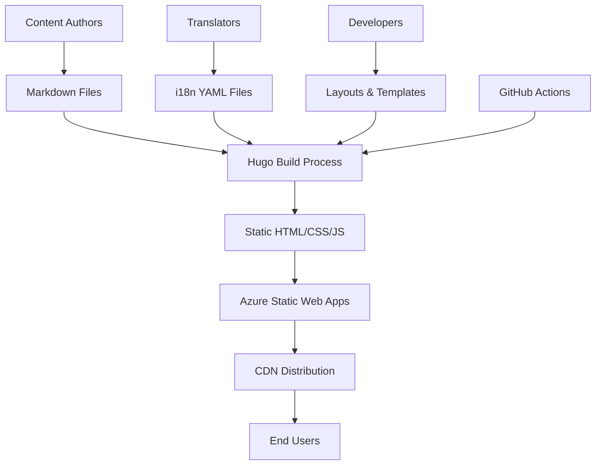

# 🏗️ Architecture Overview

This document provides a detailed overview of the Scrum Guide Expansion Pack's technical architecture and design decisions.

## Technology Stack

### Core Technologies

- **[Hugo](https://gohugo.io/)** - Static site generator (Extended v0.146.0+ required for new template system)
- **[Bootstrap 5](https://getbootstrap.com/)** - CSS framework for responsive design
- **[Font Awesome](https://fontawesome.com/)** - Icon library
- **[Azure Static Web Apps](https://azure.microsoft.com/services/app-service/static/)** - Hosting platform

### Development Tools

- **Git** - Version control
- **GitHub Actions** - CI/CD pipeline
- **PowerShell** - Scripting and automation
- **Markdown** - Content authoring

## System Architecture



## Directory Structure Deep Dive

### `/site/` - Hugo Source

The main Hugo site directory containing all source files:

```text
site/
├── content/                    # Markdown content files
│   ├── _index.md              # Homepage content
│   ├── scrum-guide-expanded/  # CORE GUIDE - Main comprehensive document
│   │   ├── _index.md          # Guide landing page
│   │   ├── 2026.1/            # Version 2026.1
│   │   │   ├── index.md       # English content
│   │   │   ├── index.de.md    # German content
│   │   │   └── pdf/           # Generated PDFs
│   │   ├── 2025.6/            # Previous version
│   │   ├── history/           # Version history
│   │   └── translations/      # Translation metadata
│   ├── complexity/            # EXTENSION GUIDE - Complexity in Scrum
│   ├── psychological-safety-in-scrum-teams/  # EXTENSION GUIDE
│   ├── adaptive-enterprise/   # EXTENSION GUIDE
│   ├── adaptive-executive/    # EXTENSION GUIDE
│   ├── ai-and-scrum/          # EXTENSION GUIDE
│   ├── holistic-testing/      # EXTENSION GUIDE
│   ├── multi-team-scrum/      # EXTENSION GUIDE
│   ├── product-thinking/      # EXTENSION GUIDE
│   ├── software-engineering-practices/  # EXTENSION GUIDE
│   ├── [+6 more guides]/      # Additional extension guides
│   └── creators/              # LEGACY - Kept for backward compatibility
├── layouts/                   # HTML templates (uses Hugo module + local overrides)
│   ├── index.html            # Homepage template
│   ├── categories/           # Category-specific templates
│   │   └── list.html
│   ├── creators/             # Creator-specific templates (legacy)
│   │   ├── list.html
│   │   └── single.html
│   ├── _partials/            # Reusable components
│   │   ├── components/
│   │   ├── functions/
│   │   └── hooks/
│   └── _markup/              # Render hooks for markdown elements
│       ├── render-blockquote.html
│       └── render-image.html
├── static/                    # Static assets
│   ├── css/                  # Custom stylesheets
│   ├── images/               # Images and graphics
│   └── pdf/                  # PDF files
├── data/                      # Structured data files
├── i18n/                      # Translation files
└── hugo.yaml                  # Hugo configuration (includes module import)
```

**Note**: Base templates (`baseof.html`, `single.html`, `list.html`) are provided by the imported Hugo module (`github.com/nkdAgility/HugoGuides/module`). The local `layouts/` directory contains only template overrides and site-specific templates.

### `/docs/` - Documentation

Comprehensive project documentation for contributors and maintainers.

### `/public/` - Generated Output

Auto-generated static site files (not committed to version control in production).

### Configuration Files

- `hugo.yaml` - Main Hugo configuration
- `hugo.*.yaml` - Environment-specific configurations
- `staticwebapp.config.*.json` - Azure Static Web Apps configurations

## Content Architecture

### Versioned Guides Model

The site uses a **versioned guides architecture** where each guide is a self-contained, version-controlled document:

**Structure:**
```
guide-name/
├── _index.md           # Guide metadata and landing page
├── 2026.1/             # Current version
│   ├── index.md        # English content
│   ├── index.de.md     # German content
│   ├── index.es.md     # Spanish content
│   └── pdf/            # Generated PDFs
├── 2025.6/             # Previous version  
├── history/            # Version history and changelog
└── translations/       # Translation tracking
```

**Guide Types:**

1. **Core Guide** (`scrum-guide-expanded/`)
   - Main comprehensive companion to the 2020 Scrum Guide
   - Foundation document that extension guides reference
   - Most comprehensive and detailed

2. **Extension Guides** (e.g., `complexity/`, `psychological-safety-in-scrum-teams/`)
   - Specialized topics that expand on core concepts
   - Can be updated independently with their own versioning
   - Reference the core guide for foundational concepts

3. **Legacy Content** (`creators/`)
   - Kept for backward compatibility
   - No longer actively maintained
   - Redirects handled for old URLs

### Multilingual Support

Each version of a guide supports multiple languages:

- **English** (`en`) - Default language (index.md)
- **German** (`de`) - Deutsch (index.de.md)
- **Spanish** (`es`) - Español (index.es.md)
- **Italian** (`it`) - Italiano (index.it.md)
- **And more** - Additional languages as translated

### Content Types

1. **Versioned Guide Content** - Main content with version control
2. **Guide Landing Pages** - Overview and navigation for each guide
3. **History Pages** - Track changes between versions
4. **Translation Metadata** - Translation status and contributors

## Template Architecture

### Hugo Module System

This site uses **Hugo Modules** for template management, importing the majority of its functionality from an external module:

```yaml
# hugo.yaml
module:
  imports:
    - path: github.com/nkdAgility/HugoGuides/module
```

**Module Repository**: [github.com/nkdAgility/HugoGuides](https://github.com/nkdAgility/HugoGuides/)

**What this means:**
- Base templates (`baseof.html`, `single.html`, `list.html`, `home.html`) come from the imported module
- Local `layouts/` directory contains only **overrides** and **site-specific templates**
- Module provides consistent structure across multiple guide sites
- The majority of site functionality (templates, partials, layouts) is maintained in the HugoGuides module
- Updates to base templates happen at the module level
- This allows multiple guide sites to share common functionality

### Local Template Structure

The local `layouts/` directory contains:

1. **Homepage**: `index.html` - Custom homepage layout
2. **Content-specific overrides**: `creators/`, `categories/`
3. **Partials**: `_partials/components/`, `_partials/functions/`, `_partials/hooks/`
4. **Render hooks**: `_markup/render-blockquote.html`, `_markup/render-image.html`

### Template Lookup

Hugo follows standard template lookup but checks local layouts first, then falls back to the module:

1. Local `layouts/` directory (overrides)
2. Hugo module templates (base/default)
3. Hugo's built-in templates (last resort)

### Key Templates

- **`baseof.html`** - Base template with common HTML structure
- **`home.html`** - Homepage template (renamed from `index.html`)
- **`single.html`** - Individual page template
- **`list.html`** - List/index page template
- **`all.html`** - New catch-all template for any page type

## Build Process

### Development Build

```bash
cd site
hugo server -D --bind 0.0.0.0 --port 1313
```

### Production Build

```bash
cd site
hugo --minify --environment production
```

### Environment Configurations

- **Local** (`hugo.local.yaml`) - Development settings
- **Preview** (`hugo.preview.yaml`) - Preview/staging settings
- **Canary** (`hugo.canary.yaml`) - Canary release settings
- **Production** (`hugo.yaml`) - Production settings

## Deployment Architecture

### Azure Static Web Apps

The site is deployed using Azure Static Web Apps with:

- **Automatic builds** from GitHub Actions
- **Custom domains** support
- **SSL certificates** automatically managed
- **CDN distribution** globally
- **Environment-specific deployments**

### Deployment Environments

1. **Production** - Main live site
2. **Preview** - Staging environment
3. **Canary** - Early access features

## Performance Considerations

### Optimization Strategies

- **Static generation** - No server-side processing
- **Minification** - CSS, JS, and HTML minification
- **Image optimization** - Responsive images and WebP support
- **CDN delivery** - Global content distribution
- **Caching headers** - Aggressive caching for static assets

### Build Performance

- **Incremental builds** during development
- **Asset bundling** and minification
- **Template caching** for faster rebuilds

## Security Architecture

### Content Security

- **Static files only** - No server-side vulnerabilities
- **HTTPS only** - All traffic encrypted
- **CSP headers** - Content Security Policy implementation

### Access Control

- **Repository access** - GitHub permissions
- **Deployment access** - Azure permissions
- **Review process** - Pull request requirements

## Monitoring and Analytics

### Built-in Monitoring

- **Google Analytics** - Traffic and user behavior
- **Azure Application Insights** - Performance monitoring
- **GitHub Actions** - Build and deployment status

### Content Metrics

- **Page views** per language
- **Download statistics** for PDFs
- **User engagement** metrics

## Extensibility

### Adding New Languages

1. Create new i18n file in `i18n/[lang].yaml`
2. Add language configuration in `hugo.yaml`
3. Create translated content in `content/` directory
4. Update navigation templates

### Adding New Content Types

1. Create content archetype in `archetypes/`
2. Design specific layout in `layouts/`
3. Configure front matter requirements
4. Update navigation and menus

### Custom Functionality

- **Shortcodes** for reusable content components
- **Partial templates** for shared functionality
- **Data files** for structured content
- **Custom CSS/JS** for enhanced features

## Future Considerations

### Scalability

- **Content growth** - Efficient content organization
- **Language expansion** - Additional translations
- **Feature additions** - New content types and functionality

### Technology Updates

- **Hugo updates** - Regular framework updates
- **Dependency management** - Bootstrap and other libraries
- **Security patches** - Keeping dependencies current

---

🔙 **Back to**: [Documentation Home](./README.md)  
➡️ **Next**: [Development Guide](./development.md)
