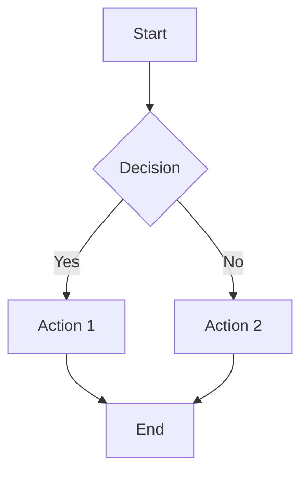
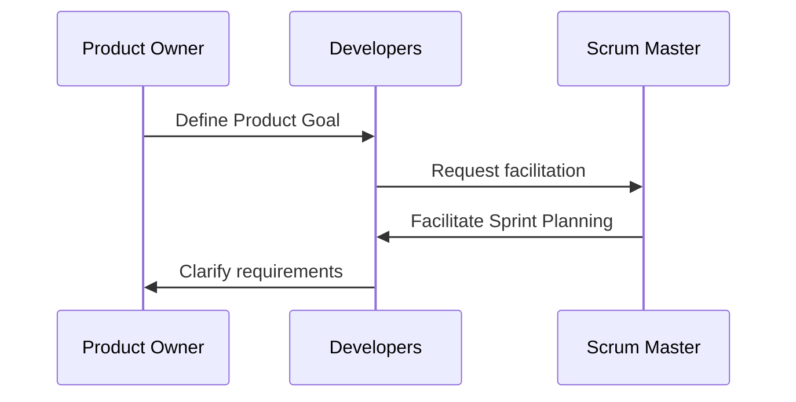
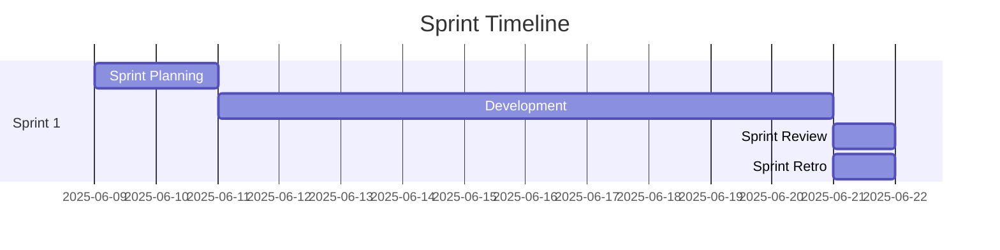

# 📝 Content Management Guide

This guide covers content creation, management, and maintenance for the Scrum Guide Expansion Pack project.

## Content Structure Overview

The site's content is organized around **versioned guides** that support multiple languages. Each guide is a self-contained document with version control.

### Guide Structure

```
site/content/
├── _index.md                              # Homepage content
├── scrum-guide-expanded/                  # CORE GUIDE - Main comprehensive document
│   ├── _index.md                         # Guide landing page
│   ├── 2026.1/                           # Version 2026.1
│   │   ├── index.md                      # English version
│   │   ├── index.de.md                   # German version
│   │   ├── index.es.md                   # Spanish version
│   │   └── pdf/                          # Generated PDFs
│   ├── 2025.6/                           # Previous version
│   ├── history/                          # Version history
│   └── translations/                     # Translation metadata
├── complexity/                            # EXTENSION GUIDE - Complexity in Scrum
│   ├── _index.md
│   ├── 2026.1/
│   ├── history/
│   └── translations/
├── psychological-safety-in-scrum-teams/  # EXTENSION GUIDE
│   ├── _index.md
│   ├── 2026.1/
│   ├── history/
│   └── translations/
├── adaptive-enterprise/                   # EXTENSION GUIDE
├── multi-team-scrum/                      # EXTENSION GUIDE
├── software-engineering-practices/        # EXTENSION GUIDE
└── creators/                              # LEGACY - Kept for backward compatibility
    ├── _index.md
    ├── ralph-jocham/
    ├── john-coleman/
    └── jeff-sutherland/
```

### Content Types

#### 1. Core Guide

**Location**: `/content/scrum-guide-expanded/`

The main comprehensive companion to the 2020 Scrum Guide. This is the primary document that all extension guides build upon.

#### 2. Extension Guides

**Locations**: `/content/complexity/`, `/content/psychological-safety-in-scrum-teams/`, etc.

Specialized guides that expand on specific topics. Each extension guide:


- Has its own versioning
- Can be updated independently
- References the core guide
- Follows the same structure as the core guide

#### Front Matter Structure

**Guide Index (`_index.md`)** - Defines the guide itself:

```yaml
---
title: Psychological Safety in Scrum Teams
description: Learn why Scrum turns into empty mechanics when people do not feel safe to speak up.
Type: "guide"
Layout: "root"
brand:
  bg_colour: "#0072B2"
  image: "images/scrum-guide-expansion-pack-logo-solo.png"
weight: 2
guide_license: |
  License: Creative Commons Attribution-ShareAlike 4.0 International ( CC BY-SA 4.0  ).
categories:
  - Safety
  - Transparency
  - Teams
tags:
  - Psychological safety
  - Scrum Teams
sitemap:
  priority: 0.8
---
```

**Version Content (`2026.1/index.md`)** - The actual guide content:

```yaml
---
title: Psychological Safety in Scrum Teams (Expansion of the SGEP)
subtitle: An empirical lens on safety as a foundation for learning
description: A research-based examination of psychological safety in Scrum Teams.
keywords:
  - Psychological safety
  - Scrum Teams
  - Empiricism
author:
  - Joanna Płaskonka 
date: 2026-01-18T09:00:00Z
type: guide
lang: en
sitemap:
  priority: 0.7
---
```

##### Front Matter Options

- **`title`** - Page title (required)
- **`description`** - SEO meta description (required)
- **`date`** - Publication date (required)
- **`weight`** - Sort order for navigation (optional)
- **`draft`** - Set to `true` to hide from production (default: `false`)
- **`type`** - Content type (e.g., "guide", "creator")
- **`layout`** - Template layout to use
- **`enableMermaid`** - Enable Mermaid.js for diagrams (default: `false`)

#### Content Guidelines

- Use **semantic markdown** structure (H1 → H2 → H3)
- Include **table of contents** for long sections
- Add **cross-references** between related sections
- Use **blockquotes** for important callouts
- Include **practical examples** and scenarios

#### Blockquotes and Callouts

The site supports standard blockquotes and enhanced alert-style callouts to highlight important information.

##### Standard Blockquotes

Use standard markdown blockquotes for quotations or simple callouts:

```markdown
> This is a standard blockquote.
> It can span multiple lines.
```

**Renders as:**
A styled blockquote with a vertical accent bar on the left.

##### Alert-Style Callouts

For more prominent callouts, use GitHub-flavored alert syntax with these types:

**Available Alert Types:**

- **`[!NOTE]`** - General information (blue, info icon ℹ️)
- **`[!TIP]`** - Helpful suggestions (green, lightbulb icon 💡)
- **`[!IMPORTANT]`** - Critical information (yellow, warning icon ⚠️)
- **`[!WARNING]`** - Important warnings (yellow, warning icon ⚠️)
- **`[!CAUTION]`** - Serious warnings (red, alert icon 🚨)
- **`[!HIGHLIGHT]`** - Key concepts to emphasize (special highlight style)

**Syntax:**

```markdown
> [!NOTE]
> This is a note with default title.

> [!TIP] Custom Title
> This is a tip with a custom title.

> [!IMPORTANT]
> This is important information that requires attention.

> [!WARNING] Proceed with Caution
> This warning has a custom title.

> [!CAUTION]
> This is a serious caution message.

> [!HIGHLIGHT] Model Mismatch
> When the business theory embedded in your operating model no longer aligns 
> with your environment, the model becomes a systematic source of waste—no 
> matter how well you execute it.
```

**Usage Guidelines:**

- **Use sparingly** - Too many callouts reduce their effectiveness
- **Be specific** - Choose the alert type that best matches the content's purpose
- **Custom titles** - Add descriptive titles after the alert type for clarity
- **Keep concise** - Callouts should be brief and focused
- **Placement** - Position callouts near related content for context

**Best Practices:**

- `[!NOTE]` - For additional context, explanations, or clarifications
- `[!TIP]` - For helpful suggestions, best practices, or pro tips
- `[!IMPORTANT]` - For critical information that must not be overlooked
- `[!WARNING]` - For potential pitfalls or common mistakes to avoid
- `[!CAUTION]` - For serious consequences or risks
- `[!HIGHLIGHT]` - For key insights, principles, or memorable takeaways

**Example from Operating Models Guide:**

```markdown
> [!HIGHLIGHT] The Leadership Error
> Claiming "We're agile" while demanding fixed scope, fixed dates, and maximum 
> utilization is not a product issue. It's a leadership and organizational design 
> issue masquerading as an execution problem.
```

#### Diagrams with Mermaid.js

The site supports Mermaid.js for creating diagrams directly in markdown. This feature must be explicitly enabled per page.

##### Enabling Mermaid

To use Mermaid diagrams on a page, add `enableMermaid: true` to the front matter:

```yaml
---
title: "Your Guide Page"
enableMermaid: true
---
```

**Important:** Mermaid is **disabled by default** to optimize page load performance. Only enable it on pages that actually use diagrams.

##### Creating Diagrams

Once enabled, create diagrams using fenced code blocks with the `mermaid` language identifier:

**Flowchart Example:**

````markdown

````

**Sequence Diagram Example:**

````markdown

````

**Gantt Chart Example:**

````markdown

````

##### Supported Diagram Types

Mermaid.js supports many diagram types:

- **Flowcharts** - Process flows and decision trees
- **Sequence Diagrams** - Interaction between participants
- **Class Diagrams** - Object-oriented structures
- **State Diagrams** - State machines and transitions
- **Entity-Relationship Diagrams** - Database schemas
- **Gantt Charts** - Project timelines
- **Pie Charts** - Data visualization
- **Git Graphs** - Branch and merge visualization

##### Best Practices

- **Enable only when needed** - Keep `enableMermaid: false` unless the page uses diagrams
- **Keep diagrams simple** - Complex diagrams may be hard to read on mobile
- **Use descriptive labels** - Make diagram elements self-explanatory
- **Test rendering** - Preview diagrams locally before committing
- **Provide alt text context** - Add explanatory text before/after diagrams
- **Consider accessibility** - Ensure diagrams complement, not replace, text explanations

##### Mermaid Resources

- [Mermaid.js Official Documentation](https://mermaid.js.org/)
- [Mermaid Live Editor](https://mermaid.live/) - Test diagrams online
- [Syntax Reference](https://mermaid.js.org/intro/syntax-reference.html)

### 2. Creator Profiles

Creator profiles showcase the authors and contributors to the expansion pack.

#### Profile Structure

```yaml
---
title: "Ralph Jocham"
description: "Professional Scrum Trainer and Agile Coach"
date: 2025-06-09
weight: 1
draft: false
type: "creator"
image: "ralph-jocham.jpg"
role: "Professional Scrum Trainer"
company: "Agile Coach Academy"
website: "https://example.com"
linkedin: "https://linkedin.com/in/example"
twitter: "https://twitter.com/example"
---

# Ralph Jocham

Brief biography and background...

## Experience
- Professional experience details
- Key achievements
- Relevant certifications

## Contributions
- Specific contributions to the Scrum Guide Expansion Pack
- Areas of expertise
```

### 3. Contributor Attribution (Current System)

**Location**: `site/data/contributions/`

Each guide has a corresponding contributor file that tracks all contributors to that specific guide. This system provides proper attribution and enables the site to display contributor information consistently.

#### Structure

Each guide has a YAML file named after the guide's slug:

```
site/data/contributions/
├── scrum-guide-expanded.yml         # Core guide contributors
├── complexity.yml                    # Complexity guide contributors
├── psychological-safety-in-scrum-teams.yml
├── software-engineering-practices.yml
└── [other-guide-slug].yml
```

#### Contributor File Format

Each file contains a list of contributors with their information:

```yaml
# Contributions Data
# This file contains information about all contributors to [Guide Name]

# All contributors in a flat list
- name: John Coleman
  githubUsername: ViralGoodAgile
  url: https://www.linkedin.com/in/johnanthonycoleman/
  contributions:
    - "2026.1"
    - "2025.6"
  role: creator
  founder: true
  weight: 1

- name: Dave Farley
  url: https://www.continuous-delivery.co.uk/
  image: /images/contributors/david-farley.jpg
  contributions:
    - "2026.1"
  role: contributor
  weight: 2
```

#### Contributor Properties

| Property | Required | Description | Example |
|----------|----------|-------------|---------|
| `name` | ✅ Yes | Full name of contributor | `"John Coleman"` |
| `url` | ✅ Yes | Personal website or LinkedIn profile | `"https://linkedin.com/in/..."` |
| `githubUsername` | ⚠️ Preferred | GitHub username (automatically pulls profile image) | `"ViralGoodAgile"` |
| `gravatar` | No | Gravatar email hash for profile image | `"abc123..."` |
| `image` | No | Path to uploaded image | `"/images/contributors/name.jpg"` |
| `contributions` | ✅ Yes | List of version numbers contributed to | `["2026.1", "2025.6"]` |
| `role` | ✅ Yes | Contributor role | `"creator"`, `"contributor"`, `"translator"` |
| `founder` | No | Boolean indicating founding contributor | `true` or `false` |
| `weight` | No | Display order (lower numbers first) | `1`, `2`, `3`, etc. |

#### Image Priority System

The site displays contributor images using the following priority:

1. **`githubUsername`** - Automatically fetches from GitHub profile (PREFERRED)
2. **`gravatar`** - Uses Gravatar email hash
3. **`image`** - Uses uploaded image path

**Example Priority:**

```yaml
# Priority 1: GitHub (automatic, always current)
- name: Ralph Jocham
  githubUsername: rjocham
  url: https://effectiveagile.com/

# Priority 3: Custom image (manual upload required)
- name: Dave Farley
  image: /images/contributors/david-farley.jpg
  url: https://www.continuous-delivery.co.uk/
```

#### Adding a New Contributor

**Steps:**

1. **Identify the guide**: Determine which guide the person contributed to
2. **Open the contributor file**: `site/data/contributions/{guide-slug}.yml`
3. **Add contributor entry**:

```yaml
- name: "Contributor Full Name"
  githubUsername: "their-github-username"  # PREFERRED METHOD
  url: "https://their-website-or-linkedin.com"
  contributions:
    - "2026.1"  # Version(s) they contributed to
  role: "contributor"  # creator, contributor, translator, reviewer
  weight: 10  # Display order (optional)
```

4. **For custom images** (if GitHub not available):
   - Upload image to: `site/static/images/contributors/`
   - Use format: `firstname-lastname.jpg` (lowercase, hyphens)
   - Reference as: `image: /images/contributors/firstname-lastname.jpg`
   - Recommended size: 200x200px minimum, square aspect ratio

5. **Test locally**: `hugo server -D --source site`
6. **Submit PR**: Follow [Contributing Guide](./contributing.md)

#### Contributor Roles

| Role | Description | Example Use |
|------|-------------|-------------|
| `creator` | Original author of the guide | Core guide authors |
| `contributor` | Added content or significant edits | Subject matter experts |
| `translator` | Translated guide to another language | Language translators |
| `reviewer` | Reviewed and provided feedback | Technical reviewers |

#### Example: Complete Contributor File

```yaml
# Contributions Data
# This file contains information about all contributors to the Software Engineering Practices Guide

# Founders (original creators)
- name: Dave Farley
  url: https://www.continuous-delivery.co.uk/
  image: /images/contributors/david-farley.jpg
  contributions:
    - "2026.1"
  role: creator
  founder: true
  weight: 1

# Contributors
- name: Martin Hinshelwood
  githubUsername: nkdAgility
  url: https://nkdagility.com/
  contributions:
    - "2026.1"
  role: contributor
  weight: 2

# Translators
- name: German Translation Team
  url: https://github.com/ScrumGuides/ScrumGuide-ExpansionPack/discussions
  contributions:
    - "2026.1"
  role: translator
  weight: 10
```

#### Best Practices

**DO:**
- ✅ Use `githubUsername` whenever possible (automatic image updates)
- ✅ List all version numbers contributor worked on
- ✅ Keep entries in logical order using `weight`
- ✅ Include meaningful URLs (LinkedIn, personal site, GitHub)
- ✅ Use consistent role naming

**DON'T:**
- ❌ Upload images if GitHub username is available
- ❌ Use high-resolution images (keep under 500KB)
- ❌ Forget to add new version numbers when updates occur
- ❌ Remove previous contributors without permission
- ❌ Use placeholder or demo content

### 4. Download Pages

Information about available downloads, including PDFs and resources.

```yaml
---
title: "Downloads"
description: "Download the Scrum Guide Expansion Pack in various formats"
date: 2025-06-09
weight: 20
draft: false
type: "download"
---

# Available Downloads

## PDF Versions
- **English**: [Download PDF](../pdf/scrum-guide-expansion-pack-en.pdf)
```

## Multilingual Content Management

### Language Structure

Each language has its own content directory structure:

```
content/
├── guide/          # English (default)
├───├──   index.md       # English (default)
├───├──   index.de.md       # German (Deutsch) example
```

### Translation Workflow

#### 1. Create Base Content (English)

Start with English content as the source:

```markdown
---
title: "Scrum Events"
description: "Detailed explanation of Scrum Events"
date: 2025-06-09
weight: 30
draft: false
---

# Scrum Events

The Scrum Events are timeboxed meetings...
```

#### 2. Translate Content

Create corresponding files in other languages:

**German (`content/guide/events.de.md`)**:

```markdown
---
title: "Scrum Ereignisse"
description: "Detaillierte Erklärung der Scrum Ereignisse"
date: 2025-06-09
weight: 30
draft: false
---

# Scrum Ereignisse

Die Scrum Ereignisse sind zeitlich begrenzte Meetings...
```

#### 3. Translation Guidelines

- **Maintain structure** - Keep the same heading hierarchy
- **Preserve links** - Update internal links to translated pages
- **Keep categories and tags identical** - Do not translate `categories` or `tags` in frontmatter; use exact same values as English
- **Cultural adaptation** - Adapt examples for local context
- **Consistent terminology** - Use established Scrum translations
- **Review process** - Have native speakers review translations

### Translation Resources

- **Scrum.org** official translations
- **Agile Alliance** glossary
- **Local Scrum communities** for terminology consistency

## Content Creation Workflow

### 1. Planning Phase

Before creating content:

- [ ] **Define objectives** - What should readers learn?
- [ ] **Identify audience** - Who will read this content?
- [ ] **Research thoroughly** - Ensure accuracy and completeness
- [ ] **Plan structure** - Outline headings and sections
- [ ] **Consider translations** - Plan for multilingual versions

### 2. Content Creation

```powershell
# Create new content file
cd site
hugo new content/guide/new-section.md

# Edit the file with your preferred editor
code content/guide/new-section.md
```

### 3. Content Review Process

1. **Self-review** - Check for errors and clarity
2. **Technical review** - Verify Scrum concepts are accurate
3. **Editorial review** - Check grammar and style
4. **Translation review** - Review translated versions
5. **Final approval** - Get maintainer approval

### 4. Publishing Process

```powershell
# Set draft to false when ready
# Update front matter in content file
draft: false

# Test locally
hugo server -D

# Commit and push
git add .
git commit -m "feat: add new content section"
git push origin feature/new-content
```

## Content Maintenance

### Regular Maintenance Tasks

#### Weekly

- [ ] **Check for typos** and grammatical errors
- [ ] **Verify links** are working correctly
- [ ] **Review analytics** for popular content
- [ ] **Monitor feedback** from users

#### Monthly

- [ ] **Update content** based on Scrum Guide changes
- [ ] **Review translations** for accuracy
- [ ] **Check image quality** and optimization
- [ ] **Update creator profiles** if needed

#### Quarterly

- [ ] **Content audit** - Remove outdated information
- [ ] **SEO review** - Update meta descriptions and titles
- [ ] **Accessibility check** - Ensure content is accessible
- [ ] **Performance review** - Optimize content for speed

### Content Standards

#### Writing Style

- **Clear and concise** - Use simple, direct language
- **Active voice** - Prefer active over passive voice
- **Consistent terminology** - Use Scrum terms consistently
- **Practical examples** - Include real-world scenarios
- **Inclusive language** - Use gender-neutral and inclusive terms

#### Formatting Standards

- **Headings**: Use semantic hierarchy (H1 → H2 → H3)
- **Lists**: Use bullet points for unordered items, numbers for sequences
- **Emphasis**: Use **bold** for important terms, _italics_ for emphasis
- **Links**: Use descriptive link text, not "click here"
- **Images**: Include alt text for accessibility

#### SEO Best Practices

- **Meta descriptions**: 150-160 characters, compelling and descriptive
- **Title tags**: Include target keywords, under 60 characters
- **Headings**: Use keywords naturally in headings
- **Internal linking**: Link to related content within the site
- **Image optimization**: Use descriptive filenames and alt text

## Digital Asset Management

### Images and Graphics

#### Image Guidelines

- **Format**: Use WebP for web, fallback to JPG/PNG
- **Size**: Optimize for web (typically under 1MB)
- **Dimensions**: Use consistent aspect ratios
- **Naming**: Use descriptive, kebab-case names
- **Alt text**: Always include meaningful alt text

#### Storage Structure

```
static/images/
├── creators/           # Creator profile photos
├── guide/             # Guide-related illustrations
├── logos/             # Brand logos and icons
└── general/           # General purpose images
```

#### Image Processing

```powershell
# Using Hugo's image processing (in templates)
{{ $image := resources.Get "images/example.jpg" }}
{{ $resized := $image.Resize "800x" }}

```

### PDF Management

#### PDF Generation

PDFs are generated from the Hugo site content using external tools or services.

#### PDF Storage

```
static/pdf/
├── scrum-guide-expansion-pack-en.pdf
├── scrum-guide-expansion-pack-de.pdf
├── scrum-guide-expansion-pack-es.pdf
└── scrum-guide-expansion-pack-fr.pdf
```

#### PDF Update Process

1. **Generate** new PDF from updated content
2. **Review** PDF for formatting and accuracy
3. **Replace** old PDF in `/static/pdf/` directory
4. **Update** download links if needed
5. **Test** download functionality

## Content Analytics and Optimization

### Analytics Setup

- **Google Analytics** - Track page views and user behavior
- **Search Console** - Monitor search performance
- **Heat mapping** - Understand user interaction patterns

### Key Metrics to Monitor

- **Page views** per content section
- **Time on page** for guide content
- **Bounce rate** for different content types
- **Download statistics** for PDFs
- **Search queries** leading to content

### Content Optimization

Based on analytics data:

- **Improve** low-performing content
- **Expand** popular sections
- **Fix** high bounce rate pages
- **Update** outdated information
- **Enhance** user experience

## Accessibility Guidelines

### Content Accessibility

- **Alt text** for all images
- **Descriptive headings** that make sense out of context
- **Meaningful link text** that describes the destination
- **Color contrast** meets WCAG AA standards
- **Reading level** appropriate for audience

### Testing Accessibility

```powershell
# Install accessibility testing tools
npm install -g pa11y axe-cli

# Test pages for accessibility
pa11y http://localhost:1313
axe http://localhost:1313
```

## Content Backup and Recovery

### Backup Strategy

- **Git repository** serves as primary backup
- **GitHub** provides remote backup
- **Local backups** of generated PDFs and images
- **Regular exports** of analytics data

### Recovery Procedures

1. **Content corruption**: Restore from Git history
2. **Accidental deletion**: Use Git to recover files
3. **Site rebuild**: Regenerate from source content
4. **Data loss**: Restore from backup repositories

---

🔙 **Back to**: [Documentation Home](./README.md)  
➡️ **Next**: [Configuration Reference](./configuration.md)
