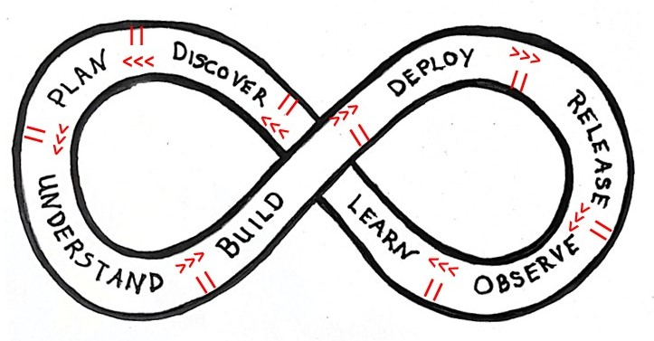
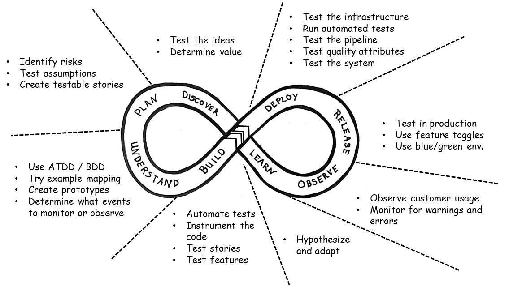
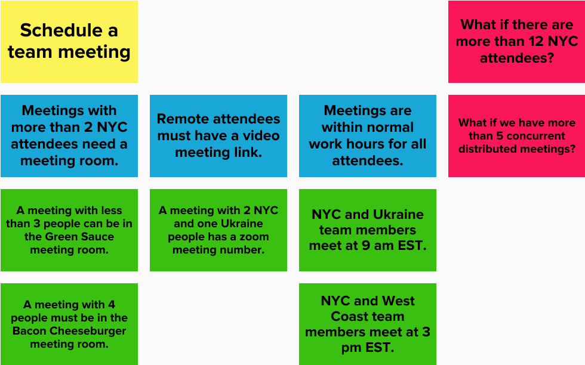

**_Collected Resources for Scrum Guide Expansion Pack_**  
_This document is a collection of independent works. Each section retains its original license or copyright status, as indicated. Please refer to each section for specific usage rights and requirements._

Title: Holistic Testing  
Author: _Lisa Crispin_  
Source: (1)  
License/Copyright: [CC BY-NC-ND 4.0](https://creativecommons.org/licenses/by-nc-nd/4.0/)  
Note: This section is included in its original, unaltered form with permission under the terms of the [CC BY-NC-ND 4.0](https://creativecommons.org/licenses/by-nc-nd/4.0/) license. No changes have been made.

# **Holistic Testing, Quality Engineering, and Scrum**

Lisa Crispin (with material from Janet Gregory)

Cross-functional Scrum Teams collaborate closely with customers, users, Stakeholders, and Supporters to deliver products that their customers value. The Supporters and customers expect quality to be built into the products. The entire Scrum Team is responsible for quality and testing. Testing activities occur throughout the whole infinite loop of software development.

Consider testing from a holistic point of view. There are so many types of testing activities. The Holistic Testing Model provides a visual thinking tool to help Scrum Teams plan a comprehensive testing strategy that includes the entire development life cycle. Quality engineers, known by a variety of other job titles, are, as Product Developers, part of the Scrum Team and partner with the Product Owner and operations to embed quality throughout the life cycle.

## **The Holistic Testing Model**

The Holistic Testing Model reflects the need for the whole Scrum Team to take ownership of quality and testing, engaging in testing activities around the whole infinite loop of software development. On the left side of the loop, these activities aim to prevent problems by identifying risks, prioritizing quality attributes [1][2] (also referred to as non-functional requirements, or NFRs) such as security and performance, surfacing hidden assumptions, and including all necessary capabilities. Testing extends around the right side of the loop, in both pre-production and production environments.

There are no handoffs between Scrum Teams in modern software testing. The pauses in the model indicate a time for the Scrum Team to pause and reflect on what they've done so far and whether they are ready to continue to the next stage. There are no rules about how long the Scrum Team should spend in each stage when implementing a new change to a product. They may get to a stage and realize they have to circle back to a previous stage where they missed something.

The next figure shows the same Holistic Testing Model with example testing activities. These are only examples, not necessarily best practices. Different Scrum Teams may do different activities, at different times, depending on their context. The key is to have effective conversations about testing and quality, with the whole team and Supporters, throughout the development cycle. Continuous improvement through small experiments and short feedback loops is the focus. Each Scrum Team needs to plan a testing strategy that includes all the necessary activities at the right time - throughout the development cycle.

Let's walk through the different stages of the model, which are basically the stages of the modern software development life cycle. Software development is an infinite loop, and new changes often begin with discovery, so we will start there.

## **Testing Early \- Discover and Plan**

Frequent delivery of small, sustainable changes is the key for software teams to continually deliver new value to customers. As Google's DORA research has shown over several years:

_“Working in small batches” is a long-time DORA Capability, which refers to the degree to which teams break down their changes into manageable units that can be quickly tested and evaluated._ " [3]

Teams need those quick feedback loops to build quality in. That means preventing bugs by brainstorming about the value to customers and risks as soon as we start working on a new change.

Teams do lots of testing in these stages – testing ideas, understanding user needs, looking for risks, and thinking about how to mitigate them. Together with Supporters, Stakeholders, and customers, they discuss the user needs. They ask questions like "What problem is this solving for the customer? What is the main value this capability should provide?"

[Google's 2024 DORA research report](https://dora.dev/research/2024/dora-report/) [4] found that "alignment between what Product Developers build and what users need allows employees and organizations to thrive." [3]. Their research showed that prioritizing the end user helps development teams and their organizations perform better. Investing time in structured conversations to plan new features pays off by making sure the right capabilities are delivered on the first try.

They use visual frameworks such as risk storming [5] to identify potential risks and brainstorm ways to mitigate them. They might choose to mitigate them through automated tests or by monitoring and [observability](https://charity.wtf/2020/03/03/observability-is-a-many-splendored-thing/) [6]. For example, teams use [Open Telemetry](https://opentelemetry.io/) [7] to ensure they capture all data and events needed to understand any unexpected problems [8].

Prioritizing the top risks and quality attributes helps the Scrum Team plan how to mitigate them. They can make sure they build in the appropriate levels of attributes, such as performance, availability, and security, that the business and customers require. This enables the creation of appropriate acceptance and outcome criteria for each new feature.

Here's an example of a risk brainstorming exercise done by members of the delivery Scrum Team and Stakeholders whose company has a "horse and donkey motels" web-based application. They considered risks around a new product backlog item (in story format) to add the capability for customers to cancel their booking for their equine and people accommodation.

These planning discussions often show that a proposed feature is too big and needs to be broken down into smaller components. The goal of this stage is to break each new feature into small, testable product backlog items.

## **Seek to Understand**

Once the Scrum Team, in collaboration with Stakeholders and Supporters, has created those small, testable product backlog itemsstories, it's time to dig into the details and get a shared understanding of each onestory. In Refinement and Sprint Planning, Product Developers and Stakeholders discuss the goal, the business rules, and the concrete example for each business rule.

To work as effectively as possible, they use visual frameworks like [example mapping](https://cucumber.io/blog/bdd/example-mapping-introduction/) [9]. These structured frameworks keep conversations on track and help everyone reframe the problem and see what emerges. The Scrum Team members also identify the data and events to capture through logging and instrumentation in the code, so they can monitor and understand what happens in production after deployment.

These structured conversations let the Scrum Team plan how to mitigate the top priority risks for each story. They can create acceptance and outcome criteria that ensure they deliver what customers and Stakeholders value most.

Here's a sample example map from a Scrum Team working on a web-based app that allows company employees to schedule Scrum Team meetings. This map was created during a short session before the official sprint planning meeting. These sessions are sometimes known as Power of Three or Three Amigos, where people with product, development, and quality domain skills collaborate [10]. In this case, the Product Owner, the quality engineer, and two programmers discuss each product backlog item that the Scrum Team would include in the subsequent Sprint Planning.

The yellow card is the product backlog item. Blue cards contain business rules, and green cards provide examples that illustrate the desired behavior for the business rules. The red cards have questions that need to be answered before the Sprint Planning.

## **Testing Activities While We Build**

Once everyone is on the same page as to how the new change should behave, the Scrum Team starts building … coding, automating, testing – not necessarily in that order. Optimally, they use good practices like [test-driven development](https://martinfowler.com/bliki/TestDrivenDevelopment.html) (TDD) [13] to get well-designed, operable, testable code.

Janet Gregory often says:

_Throw away the 'then' in 'code, then test'. Replace it with 'and'. And maybe, also reverse the order to say, 'test AND code'. Put the test first. [11]_

In the build stage, team members guide development with business-facing examples, using techniques like [behavior-driven development](https://www.manning.com/books/effective-behavior-driven-development) [12]. These examples are turned into tests, which focus on quality and value from a business perspective. The whole Scrum Team can participate in these activities, making sure they build the right thing, in the right way.

The Scrum Team automates tests as appropriate, at the appropriate levels – unit, API, workflow. The whole Scrum Team and possibly the Stakeholders are involved. As with earlier stages, they collaborate to prevent customer pain and to embed telemetry into the product to capture the data that will let us learn from production.

## **Deploying and releasing**

When new changes are deployed to production-like test environments, Scrum Team members can do more feature-level testing. The continuous integration pipelines run automated regression tests. It's a key time to test for the high-priority quality attributes, also known as non-functional requirements, such as security, accessibility, and performance.

It's also an opportunity to check that new instrumentation is capturing the right data, and new or updated dashboards and alerts are accurate. This will help measure whether the Scrum Team achieves elements of its Definition of Outcome Done. They also ensure they are ready to support the new changes in production, so we can test logging and dashboards.

A fast and reliable deployment pipeline is a necessity. It provides fast feedback, especially for Scrum Teams working towards continuous delivery. Once a feature becomes usable, Scrum Teams can conduct human-centric activities such as exploratory and accessibility testing.

Modern Scrum Teams use release strategies to enable deploying changes to production without releasing them to users. Examples of popular release strategies include:

- [Release feature toggles / flags](https://martinfowler.com/articles/feature-toggles.html) [14]: adding booleans to the code so the Scrum Team can opt to show the new change to some or all external customers, or keep it hidden. Similar toggles, called "experiment toggles", are often used for A/B testing.
- [Blue-Green deployment](https://octopus.com/devops/software-deployments/blue-green-deployment/) [15]: Two identical production environments, one live and accessible to customers, one idle and only accessible internally, referred to as “blue” and “green”. The team can deploy to the idle environment, run additional tests, and switch customer traffic to the one with the new deployment.
- [Rolling deployment](https://octopus.com/devops/software-deployments/rolling-deployment/) [16]: Deployment of a new release candidate is staggered to a subset of servers, one or a few at a time. If any problems are detected, the deployment can be halted and rolled back.

The Scrum Team, sometimes including programmers, testers/quality engineers, operations specialists, and others, discusses which release strategies would work best in their context. They can experiment with different approaches, define a hypothesis, and decide how they will measure success.

Depending on their context, the Scrum Team can safely do testing in production that couldn't be done effectively in test environments. We can gradually roll out changes to more customers while closely monitoring for any issues.

## **Observing and learning**

Once features are in production, Scrum Teams can observe customer actions and reactions. The telemetry, based on instrumentation planned in the early stages, is used here. What the team learns from observability and analytics helps the organization prioritize the next changes. Often, they will observe something completely unexpected, like customers using a new feature in an unintended way. That's an opportunity to try some new experiments in subsequent development cycles.

Together with the Guiding Coalition, we can design experiments to improve our process and product. We move on to the next iteration through the cycle, starting over with the next discovery stage.

## **Summing up**

Testing activities on the left side of the Holistic Testing loop aim to prevent defects in the code that could cost the business and its customers time and money. This is the quickest feedback, and it happens when team members with diverse skills and experience work together with the Supporters.

This collaboration continues on the right side of the loop, finding defects, missed capabilities, and deficiencies in quality attributes as quickly as possible. Learning how customers use the new changes is slower feedback; it's more expensive. If the team has built in the right telemetry and infrastructure, they can respond quickly to problems. Everyone on a Scrum Team can contribute to every stage of the Holistic Testing cycle.

## **The Quality Engineer Competency**

Everyone on a Scrum Team should have a testing mindset and engage in testing activities. They build quality in. Each Scrum Team member has their own deep skills - not everyone starts out with a testing mindset and testing skills. This diversity of skill sets, experience, and background helps the Scrum Team perform better.

A software quality engineer (QE) partners with product, development, and operations specialists to embed quality throughout the entire life cycle. Ideally, each Scrum Team has QE skills. In many organizations, a senior QE may support multiple Scrum Teams in a consulting role to build up QE skills. The QE helps all Scrum Team members learn skills to improve quality throughout the development cycle.

Quality engineers, who may also be called quality advocates, testers, or other labels, collaborate across disciplines to help manage risk, facilitate discussion, and align on quality goals. They are strategic contributors who improve processes and help the Scrum Team build process and product quality.

Key activities of a quality engineer in a Scrum Team could include:

- Design test frameworks and tools
- Track metrics and drive continuous improvement
- Participate in and even facilitate retrospectives to find ways to prevent problems from recurring
- Experiment with new practices
- Coach Scrum Teams as they look for ways to improve product and process quality
- Integrate feedback from customers

Quality is the responsibility of everyone on the Scrum Team, as well as the Stakeholders and Supporters. The Quality Engineer enables the Scrum Team to deliver reliable, valuable software. And, every Scrum Team member actively engages in testing activities that help build quality in.

## References

[1] Gregory, J. and Crisipin L. (2010) _ATDD vs. BDD vs. Specification by Example vs …_ 31 August. Available at: <https://janetgregory.ca/atdd-vs-bdd-vs-specification-by-example-vs/> (Accessed: 19 December 2025)

[2] Gregory, J. & Crispin, L., 2025. Quality Attributes – those pesky “non-functional” requirements. Agile Testing Fellowship, 17 March. Available at: <https://agiletestingfellow.com/blog/post/quality-attributes-those-pesky-non-functional-requirements> (Accessed 29 December 2025)

[3] Forsgren, N., Humble, J., Kim, G. & the DORA Team, 2025. DORA 2025 State of AI-Assisted Software Development Report. Google Cloud. Available at: <https://cloud.google.com/devops/state-of-devops> (Accessed 29 December 2025)

[4] DORA, 2024. DORA Report 2024. Google Cloud. Available at: <https://dora.dev/research/2024/dora-report/> (Accessed 29 December 2025)

[5] RiskStorming, n.d. RiskStorming. Available at: <https://riskstormingonline.com/> (Accessed 29 December 2025)

[6] Majors, C., 2020. Observability is a many-splendored thing. Charity.wtf, 3 March. Available at: <https://charity.wtf/2020/03/03/observability-is-a-many-splendored-thing/> (Accessed 29 December 2025)

[7] OpenTelemetry, n.d. OpenTelemetry. Cloud Native Computing Foundation. Available at: <https://opentelemetry.io/> (Accessed 29 December 2025)

[8] Sridharan, C., 2017. Monitoring and observability. Medium, 5 September. Available at: [https://copyconstruct.medium.com/monitoring-and-observability-8417d1952e1c](https://copyconstruct.medium.com/monitoring-and-observability-8417d1952e1c) (Accessed 29 December 2025)

[9] Cucumber Ltd., n.d. Example Mapping: an introduction. Cucumber Blog. Available at: <https://cucumber.io/blog/bdd/example-mapping-introduction/> (Accessed 29 December 2025)

[10] Wynne, M. & Hellesøy, A., 2012. The Cucumber Book: Behaviour-Driven Development for Testers and Developers. Dallas, TX: Pragmatic Bookshelf.

[11] Gregory, J. & Crispin, L., 2015. Holistic Testing: Weave Quality Into Your Product. Upper Saddle River, NJ: Addison-Wesley Professional.

[12] Smart, J.F., Molina, J. & Farcic, A., 2014. Effective Behavior-Driven Development. Shelter Island, NY: Manning Publications. Available at: <https://www.manning.com/books/effective-behavior-driven-development> (Accessed 29 December 2025)

[13] Fowler, M., 2014. Test-Driven Development. MartinFowler.com. Available at: <https://martinfowler.com/bliki/TestDrivenDevelopment.html> (Accessed 29 December 2025)

[14] Fowler, M., 2017. Feature Toggles (aka Feature Flags). MartinFowler.com. Available at: <https://martinfowler.com/articles/feature-toggles.html> (Accessed 29 December 2025)

[15] Octopus Deploy, n.d. Blue-green deployment. Available at: <https://octopus.com/devops/software-deployments/blue-green-deployment/> (Accessed 29 December 2025)

[16] Octopus Deploy, n.d. Rolling deployment. Available at: <https://octopus.com/devops/software-deployments/rolling-deployment/> (Accessed 29 December 2025)
